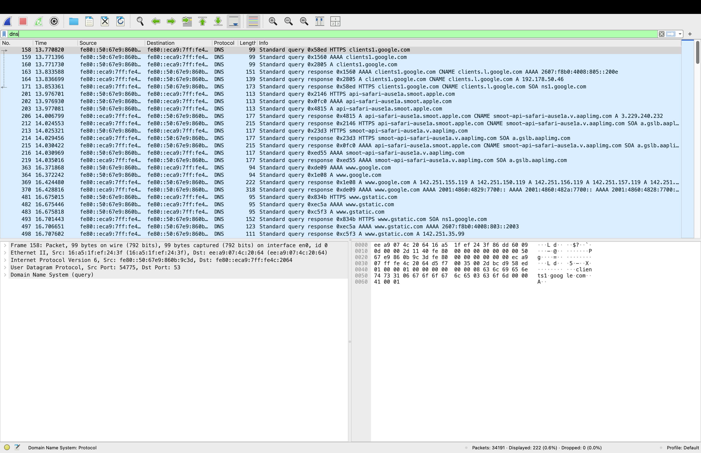
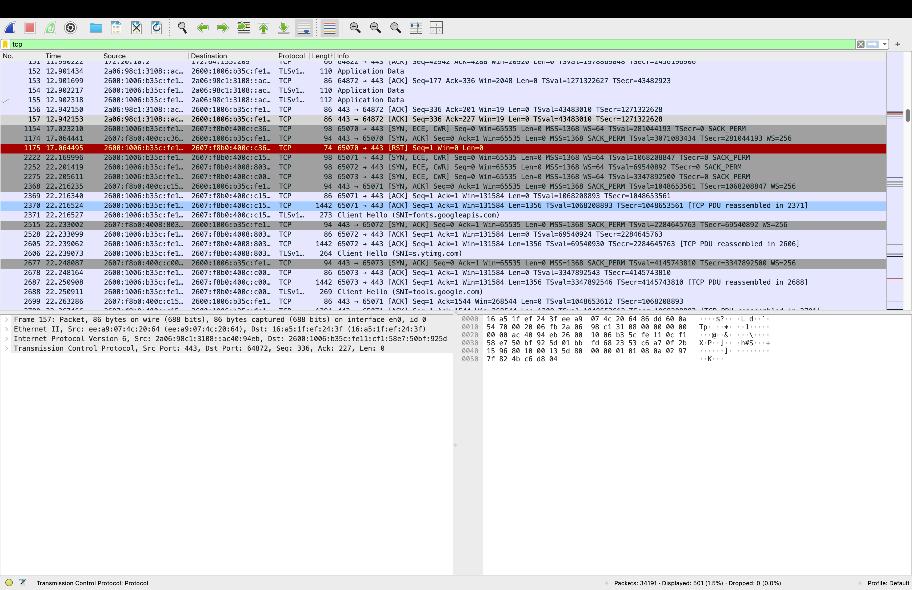
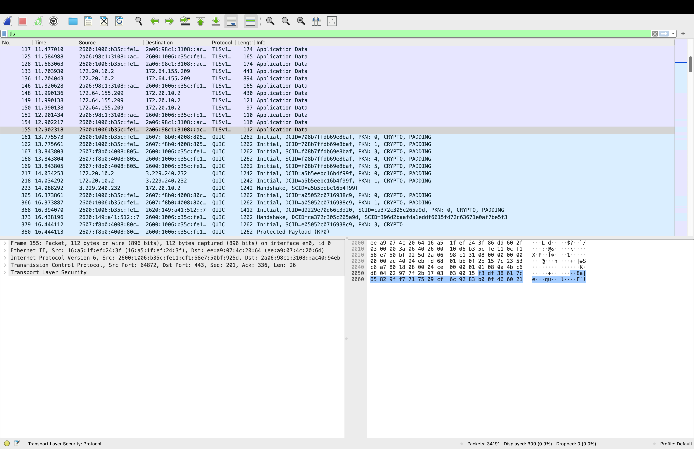

# Wireshark Network Packet Analysis

## Objective
The goal of this project was to capture and analyze real network traffic using Wireshark in order to understand how common network protocols operate.

## Tools Used
- Wireshark
- Laptop Wi-Fi network interface

## Traffic Analysis

### DNS Query
This capture shows a DNS request resolving a domain name to an IP address.

### TCP Three-Way Handshake
This capture demonstrates the TCP handshake used to establish a connection between two devices.

### TLS Encrypted Traffic
This capture shows encrypted HTTPS communication between the client and server.

## Skills Demonstrated
- Packet capture
- Network protocol analysis
- Traffic filtering using Wireshark
- Understanding DNS, TCP, and TLS communication
